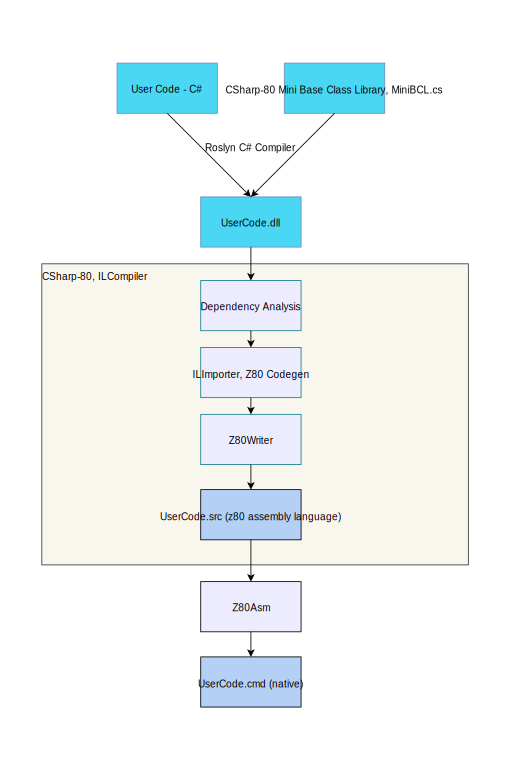

# CSharp-80 Architecture

CSharp-80 is a fun experiment in taking C#/DotNet to a 16-bit retro microcomputer, specifically the TRS-80 Model 1.

The inspiration for this was Michal Strehovsky's C# Snake game - https://github.com/MichalStrehovsky/SeeSharpSnake

## Architectural Overview

The main idea is to take the output from the regular Roslyn C# compiler and process that through the CSharp-80 ILCompiler which is an ahead of time compiler 
targetting the Z80 microprocessor. The output from the ILCompiler will be a Z80 assembly language file which will be assembled using Matthew Reed's Z80Asm 
assembler, http://www.trs-80emulators.com/z80asm/, that by default produces TRSDOS-style CMD files. These can then be used on a TRS-80 emulator or simply 
on a real TRS-80.

## Goals

* Compile CIL and produce Z80 Assembly language
* Investigate what a minimal .NET runtime could be for a 16-bit retro microcomputer
* Be able to compile the C# Snake game with minimal modifications
* Learn about AOT compilers for .NET - specifically will draw inspiration and influence from CoreRT, https://github.com/dotnet/corert

## ILCompiler Composition

### Compilation Driver
The compilation driver is embedded in the Program class and takes the roles of wiring the dependency injection container together, parsing command line arguments, 
and invoking the compiler itself. Note that the command line arguments are passed to the main compiler via a Configuration class. Eventually the driver constructs 
a `Compilation` object that provides methods to run the compilation and write the outputs to a file on disk.

Related classes: `IConfiguration`, `ICompilation`

### Compiler
The compiler is the main core of the system and is located in the Compilation class. 

The role of the Compilation class is to perform dependency analysis on the input
to determine the set of runtime artifacts (method code bodies and data structures) that need to be generated into the output z80 assembly language file. At the moment
this simply iterates over all of the types in the input file and then iterates across all of the methods in these types creating a Z80MethodCodeNode for each one and 
passing this to the ILImporter class to compile the method.

Once progress has been made on the method compilation I hope to be able to return to the dependency analysis stage of the compiler and improve this.

### Code generation
The bulk of the code generation is done as part of the ILImporter class. This identifies the basic blocks in the method to be compiled, "imports" the IL in each basic
block converting it to z80 assembly language which is stored against the block, and finally all of the basic blocks are enumerated and the generated z80 assembly language
is composed together along with appropriate prolog/epilog code and labels for each basic block acting as the target for branching operations.

## TRS-80 Emulators

I have been using the SDLTRS emulator originally written by Mark Grebe, however the fork by Jens Geuther https://gitlab.com/jengun/sdltrs seems the best upto date option 
for this emulator as per Ira Goldklang's TRS-80 Revived site http://www.trs-80.com/wordpress/emulators/.