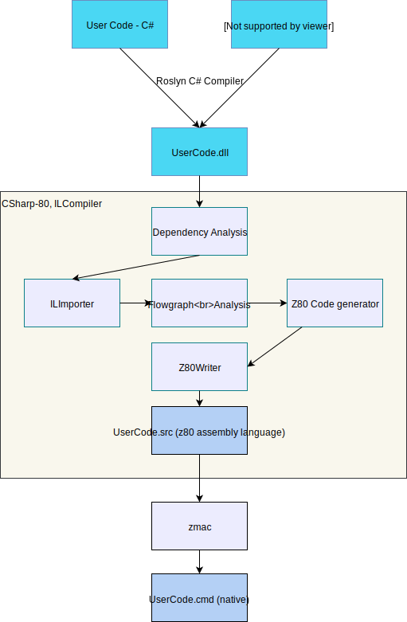

# CSharp-80 Architecture

CSharp-80 is a fun experiment in taking C#/DotNet to a 8-bit retro microcomputer, specifically the TRS-80 Model 1.

The inspiration for this was Michal Strehovsky's [C# Snake game](https://github.com/MichalStrehovsky/SeeSharpSnake)

## Architectural Overview

The main idea is to take the output from the regular Roslyn C# compiler and process that through the CSharp-80 ILCompiler which is an ahead of time compiler 
targetting the Z80 microprocessor. The output from the ILCompiler will be a Z80 assembly language file which will be assembled using George Phillip's 
[zmac](http://48k.ca/zmac.html) assembler, that can produce TRSDOS-style CMD files. These can then be used on a TRS-80 emulator 
or simply on a real TRS-80.

## Goals

* Compile CIL and produce Z80 Assembly language
* Investigate what a minimal .NET runtime could be for a 8-bit retro microcomputer
* Be able to compile the C# Snake game with minimal modifications
* Learn about AOT compilers for .NET - specifically will draw inspiration and influence from [CoreRT](https://github.com/dotnet/corert)

## ILCompiler Composition

### Compilation Driver
The compilation driver is embedded in the Program class and takes the roles of wiring the dependency injection container together, parsing command line arguments, 
and invoking the compiler itself. Note that the command line arguments are passed to the main compiler via a Configuration class. Eventually the driver constructs 
a `Compilation` object that provides methods to run the compilation and write the outputs to a file on disk.

Related classes: `IConfiguration`, `ICompilation`

### Compiler
The compiler is the main core of the system and is located in the `Compilation` class. 

The role of the `Compilation` class is to perform dependency analysis on the input to determine the set of runtime artifacts (method code bodies and data structures) that need 
to be generated into the output z80 assembly language file. The dependency analysis is performed by the `TypeDependencyAnalyser` class which iterates all types building a dependency
graph built from `Z80MethodCodeNode` objects. Each node in the graph has a list of the dependent nodes that it requires - this is determined by the code in the `MethodDependencyAnalyser`
class which scans the IL in a method identifying any dependent methods that are called by the IL.

Once the dependency graph has been built it is traversed starting from the entry method's `Z80MethodCodeNode` so only code for methods that are actually called is generated.
For each `Z80MethodCodeNode` in the graph the `MethodCompiler` class is used to compile the method to Z80 code. The `MethodCompiler` initialises the local variable table, and runs
the compiler pipeline starting with Importation, Flowgraph analysis, finishing with Code generation.

### Internal Representation (IR)
## Overview of the IR
Each method to be compiled is represented as a list of `BasicBlock` objects. Each basic block holds a list of IR nodes - at the start of the compilation these correspond to a tree
oriented form or High-level Internal Representation (HIR). In a later phase in the compiler the tree is converted into a linear ordered form or Linear Internal Representation (LIR).

Both the HIR and LIR blocks are composed of `StackEntry` objects that define the operations performed by the block. Note that all `StackEntry` objects have an associated `StackValueKind`
which represents the type of data the object represents.

### Importation
Importation is the phase that creates the IR for each method, reading in one IL instruction at a time, and building up the IR tree representation. The `ILImporter.Import(..)` method
identifies the basic blocks in the IL using the `BasicBlockAnalyser` class and then works through the basic blocks importing the IL constructing the IR tree representation. The result
is a list of the basic blocks with each block containing the imported IR tree representation of the IL instructions in each block.

### Flowgraph analysis
Currently no flowgraph analysis is performed but the IR tree representation is normalized by linking the tree nodes in evaluation order via the `Flowgraph.SetBlockOrder(..)` method.

### Code generation
Code generation is handled by the `CodeGenerator` class which first generates any constant string data, then emits a prolog for the method. Each basic block is considered in turn 
and the normalized IR is for the block is iterated converting each IR node into z80 code. Note that the generated z80 code for a basic block is then passed through the 
`CodeGenerator.Optimize(..)` method which does simple optimizations on the z80 code to make it more compact, e.g. PUSH register followed by POP register is eliminated. 
The prolog is generated as part of converting the `ReturnEntry` IR node.

## TRS-80 Emulators

The [SDLTRS](https://gitlab.com/jengun/sdltrs) emulator which is a fork created by Jens Geuther of the original witten by Mark Grebe seems the best upto date option
for emulating the TRS-80 Model 1 as per Ira Goldklang's [TRS-80 Revived site](http://www.trs-80.com/wordpress/emulators/)