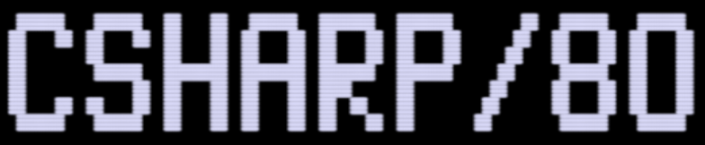
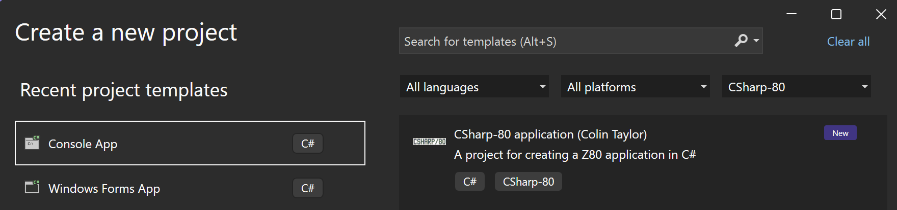

<p align="left"></p>


This repo contains a .NET ahead of time compiler targetting the Z80 8-bit microprocessor. The compiler converts managed .NET assemblies into Z80 assembly language 
which is subsequently assembled using the [zmac](http://48k.ca/zmac.html) assembler. To learn more about CSharp-80, see the
[intro document](Documentation/intro-to-csharp-80.md). Currently there is support for the Trs-80, ZX Spectrum and CPM platforms.

## How to use

Install the template:

```sh
dotnet new install csharp-80.templates
```

Create a project:

```sh
dotnet new csharp-80 
```

Or use the project template in Visual Studio:




Build it, if necessary specifying the runtime identifier, if no runtime identifier is specfied it will build for Trs80. 
Valid runtime identifiers are z80-trs80, z80-zxspectrum and z80-cpm.

```sh
dotnet build -r z80-trs80
```

At this point you will be able to see the z80 assembly in the Hello.lst file. The binary file format depends on the target platform, for Trs80 it's a cmd file,
for the ZX Spectrum it's a tap file, and for CPM it's a hex file.
You will need to use either real hardware or an appropriate emulator to run the binary file.
For Trs80 I recommend using [trs80gp](http://48k.ca/trs80gp.html) which you can simply pass the cmd file to as a parameter:

```sh
trs80gp.exe hello.cmd
```

## Samples

You can try the sample applications out online directly here:

* For [Trs-80](https://drcjt.github.io/CSharp-80/trs80/index.html)
* For [ZX Spectrum](https://drcjt.github.io/CSharp-80/zxspectrum/index.html)

## Credits
* [SeeSharpSnake](https://github.com/MichalStrehovsky/SeeSharpSnake) written by Michal Strehovský
* [CoreRT project](https://github.com/dotnet/corert) from Microsoft
* [NativeAOT](https://github.com/dotnet/runtimelab/tree/feature/NativeAOT) from Microsoft
* [RyuJit just in time compiler](https://github.com/dotnet/runtime/blob/main/docs/design/coreclr/jit/ryujit-overview.md) from Microsoft
* [z88dk z80 development kit](https://z88dk.org/site/)
* [zmac - Z80 Macro Cross Assembler](http://48k.ca/zmac.html) by George Phillips

## Goals

* Idea is to support minimal subset of C# with tiny runtime system and target Z80 processor
* Runtime support for a number of computers including
  - TRS-80 Model I/III
  - ZX Spectrum
  - CPM 
* Compile the [C# Snake game](https://github.com/MichalStrehovsky/SeeSharpSnake) with minimal modifications
* Have a range of sample applications for classic 8-bit computer programs
* Learn more about AOT and the C# runtime

## Current Status

* Compiles a number of sample programs including Snake, Life, Towers of Hanoi, Hunt the Wumpus.
* Bespoke graphics for the TRS-80
* Performance is okay - snake is quite playable. Lots of scope for improvement here
* Allocation on both stack and heap is supported
* No Garbage collection
* Lots of IL opcodes not implemented yet
* Platform support is limited for ZX Spectrum and CPM but text based samples should work fine