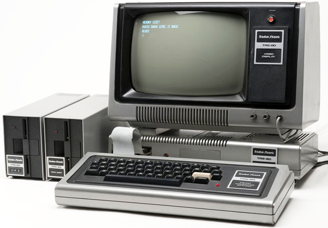

This repo contains a .NET ahead of time compiler targetting the Z80 8-bit microprocessor. Thec ompiler converts managed .NET applications into assembly language which is subsequently assembled using the [zmac](http://48k.ca/zmac.html) assembler. To learn more about CSharp-80, see the
[intro document](Documentation/intro-to-csharp-80.md)

## Credits
This project was initally inspired heavily by the [C# Snake game](https://github.com/MichalStrehovsky/SeeSharpSnake) written by Michal Strehovský, and the 
idea of being able to compile this for a retro 8 bit microcomputer. The ahead of time compilere here is influenced by the .NET Foundations 
[CoreRT project](https://github.com/dotnet/corert) and the newer [NativeAOT](https://github.com/dotnet/runtimelab/tree/feature/NativeAOT) work in the dot net 
runtime. Many ideas have been drawn from the [RyuJit just in time compiler](https://github.com/dotnet/runtime/blob/main/docs/design/coreclr/jit/ryujit-overview.md) 
in the dot net runtime. The z80 runtime code borrows heavily from the [z88dk project](https://z88dk.org/site/).

## Goals

* Idea is to support minimal subset of C# with tiny runtime system and target Z80 processor
* Runtime support for a number of computers including
  - TRS-80 Model I/III 

  - ZX Spectrum
  - CPM 
* Compile the [C# Snake game](https://github.com/MichalStrehovsky/SeeSharpSnake) with minimal modifications
* Have a range of sample applications for classic 8-bit computer programs
* Learn more about AOT and the C# runtime

## Current Status

* Try out the samples applications [here](https://drcjt.github.io/CSharp-80/index.html)
* Compiles a number of sample programs including
    - Fibonacci
    - Simple paint program
    - Snake game
    - Life
    - Towers of Hanoi
    - Prime number via several algorithms
    - Hunt the Wumpus
    - Netbot
    - Graphics demo
    - Calculate digits of Pi
* Snake, Paint, Netbot, Graphics demo use bespoke graphics for the TRS-80 using a custom System.Graphics code
* Performance is okay - snake is quite playable. Lots of scope for improvement here
* Allocation on both stack and heap is supported
* No Garbage collection
* Lots of IL opcodes not implemented yet
* Platform support is limited for ZX Spectrum and CPM but text based samples should work fine